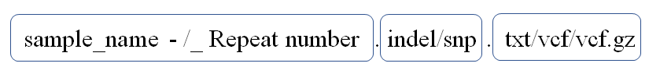
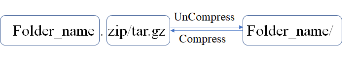

# Prepare data 
In this Chapter, we will introduce how to prepare two different input data sets: 

## Source of VCF input data 

The Variant Call Format (VCF) is used to record gene sequence variations. It is also the first file format to be understood for genome population correlation analysis. First, the whole genome sequencing file is mapping to the reference, and then the resulting bam file is comprehensively analyzed using variant calling software such as *GATK* and the reference genome data to produce the VCF result.

## Source of TXT input data

TXT files are one of several output formats annotated by *Annovar* ([Wang K, Li M, Hakonarson H. 2010](references.html#ref10)), which is able to analyze genetic variations in various genomes using the latest data. Since the input data VCF file of Annovar software only contains the starting position of the mutation, it is necessary to adjust the input data before using, and add the end position of the mutation after the actual position of the mutation. Gene-based annotations reveal variant's direct relationship with known genes and its functional impact, while region-based annotations reveal Variant's relationship with specific segments of different genomes.

## Input Data name requirements
###  Input file name requirements

```{r echo = F, fig.cap = "File-Format", out.width="80%",fig.align='center'}

```

1. The first box represents the sample name, which can be the group of experiments and the number of repetitions, connected by the character *"-"* or *"_"*.
2. The second box represents the data type, which can be snp or indel data. When snp and indel are not classified in the data, **this box is not necessary**.
3. The third box represents the data format, which can be vcf files, vcf. gz compressed files, and *Annovar* annotated TXT files.
4. The contents of the three boxes are connected by *"."*.

### Input compress files requirements

Before uploading the data to WGS-Shiny, that needs to be compressed. The following are the naming requirements for the compressed folder.

```{r echo=FALSE, fig.cap = "Fold_Format", out.width="80%",fig.align='center'}

```

1. The compressed file name must be the same as the name of the compressed folder.
2. The compressed file can be in `*.tar.gz` or `*.zip` format.

## Example data set in WGS-Shiny software
We provide a built-in dataset that can be used to explore WGS-Shiny. The data set can be directly loaded into the APP by clicking the button *“Use example data?”* of the data input module (Figure S4-II). The built-in dataset was derived from the sequencing data of published articles, including a control group and three experimental groups, with three replicates in each group ([Liang Y, Xie J, Zhang Q, et al. 2022](references.html#ref11)). The sequencing data was first mapping to the reference, followed by gatk Variants calling and Annovar annotations.

