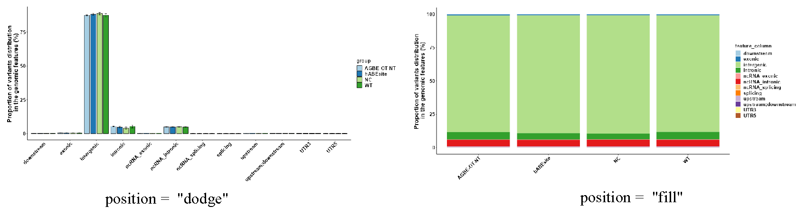
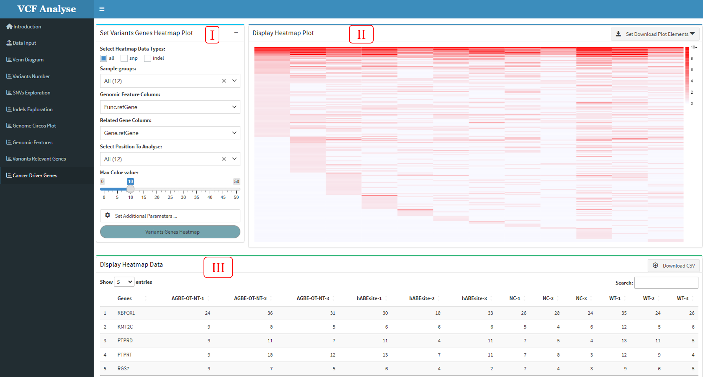

# Run The App

## Part 1: Analysis Part
### Module 1: Main Page
  In this Chapter, we will introduce step by step instruction in each module using the example built-in dataset provided at VCFshiny. After starting the VCFshiny , there are a Introduction page and nine modules: (1) Data Input; (2) Variants Numbers; (3) SNP Analysis; (4) Indel Analysis; (5) Venn Diagram; (6) Circos Plot; (7) Genomic Feature; (8) Highest Variants Genes and (9) Cancer Driver Genes on the left panel of VCFshiny *(Figure 3.1)*. For question and bug report, please leave your comment under issue section at github page. Each analysis page includes the analysis method selection module on the left with black background and the analysis module on the right with white background. Click the analysis method in the selection module to enter each analysis page.
  
```{r echo = F, fig.cap = "Main_Page", out.width="100%",fig.align='center'}
knitr::include_graphics("figure/1.main_page1.png")
```

### Module 2: Data Input
  The purpose of the "Data Input" module is for users to input their own data or use the built-in data set. The data reading module consists of three parts: the data selection part on the left, the data display part on the right and the interpretation part of the built-in data below. Add the species selection button *(Figure 3.2-I)* in the data selection part, load the built-in data  button and read the data button *(Figure 3.2-II)*, users can set the button according to their own data *(Figure 3.2-III)*, and there is also a data upload button *(Figure 3.2-IV)*. Sample selection button *(Figure 3.2-V)* is set in data display section, users can select samples for display.

```{r echo = F, fig.cap = "Data_Input", out.width="100%",fig.align='center'}

```


### Module 3: Venn Diagram
  
  In order to detect the duplicate data credibility of each group, users can cross-analyze the data using the Venn R package ([Dusa, Adrian. 2021](references.html#ref13)) and present the visualized results.
  
```{r echo = F, fig.cap = "Venn_Diagram", out.width="100%",fig.align='center'}

```
  
  The module consists of three parts: (1) The first part can select analysis data and setting visual parameter. Users can select SNP or Indel and interested groups for analysis, and parameters of Venn diagram can be set according to the provided button *(Figure 3.3-I)*. (2) The second part  is to visualize the cross data through Venn graph, and download the picture using the download button *(Figure 3.3-II)*. (3) The third part "Display Venn Data" shows the cross data and can download the data through the data button *(Figure 3.3-III)*.
  
### Module 4: Variants Number

  After uploading the data input, the uploaded input will be automatically divided into SNP and Indel according to the group. The main purpose of the analysis on the second module “Variants Number” is to display the number of SNP and Indel. 
  
```{r echo = F, fig.cap = "Variants_number", out.width="100%",fig.align='center'}

```

  The analysis module mainly includes three parts. (1) The first part is the selection and setting part, including the selection of data and the setting of graph parameters. At the same time, the transmission command window of ggplot graph command is added to the additional parameters *(Figure 3.3-I)*. (2) The second part is to display the visual results. The drop-down box of the download button is built in the upper right corner of the page, so that users can download the visual results *(Figure 3.3-II)*. (3) The third part is data display. The upper right corner of this page is built to select the data button, so that users can output the data according to their own needs *(Figure 3.4-III)*.

### Module 5: SNV Analysis

  This module is to analyze and use heatmap and bar plot to display SNP data of different groups, through which different mutation rates of each group can be clearly seen.
  
```{r echo = F, fig.cap = "SNP_Analysis_heatmap", out.width="100%",fig.align='center'}

```

```{r echo = F, fig.cap = "SNP_Analysis_Barplot", out.width="100%",fig.align='center'}

```
  
  This module includes three parts: (1) In the first part “Set SNP Analysis Plot”, users can choose drawing methods, including heat map and bar chart. The bar chart includes two stacking methods *(Figure 3.7)*, and users can choose interested experimental group and plotting parameters *(Figure 3.5-I and Figure 3.6-I)*. (2) The second part “Display SNP Analysis Plot” can display the SNP data use heatmap or bar plot, and user can use download button to download plot *(Figure 3.5-II and Figure 3.6-II)*. (3) The third part “Display SNP Analysis Data” can display the heatmap or bar plot data, and also provides the output of the data *(Figure 3.5-III and Figure 3.6-III)*.

```{r echo = F, fig.cap = "SNP_Analysis_Barpolot_type", out.width="100%",fig.align='center'}

```

### Module 6: Indel Analysis
  
  This module uses two mapping methods of Indel length density distribution map and Indel length heat map to display Indel data. Through this method, we can intuitively see the situation of various types of mutations in different populations.
  
```{r echo = F, fig.cap = "Indel_Analysis_density_plot", out.width="100%",fig.align='center'}
knitr::include_graphics("figure/6.Indel_density_plot.png")
```

```{r echo = F, fig.cap = "Indel_Analysis_heatmap_plot", out.width="100%",fig.align='center'}
knitr::include_graphics("figure/6.Indel_length_barplot_plot.png")
```

  This module consists of three parts: (1) In the first part “Set Indel Analysis Plot”, users can choose drawing methods, including density plot and heatmap plot *(Figure 3.8 and Figure 3.9)*, in which users can choose interested experimental groups and drawing parameters *(Figure 3.8-I and Figure 3.9-I)*. (2) The second part “Display Indel Analysis Plot” can display the Indel data use density plot or heatmap, and user can use download button to download plot *(Figure 3.8-II and Figure 3.9-II)*. (3) The third part “Display Indel Analysis Data” can display the density plot or heatmap data, and also provides the output of the data *(Figure 3.8-III and Figure 3.9-III)*.

  
### Module 7: Circos Plot

  In order to observe the distribution of SNP or Indel on chromosomes, the “Circos Plot” module uses the circlize R package ([Gu, Z.et al. 2014](references.html#ref14)) to plot the selected data on a chromosomal circle plot according to the location of mutations. 
  
```{r echo = F, fig.cap = "Circos_Plot", out.width="100%",fig.align='center'}
knitr::include_graphics("figure/7.Circos_plot.png")
```

  This module consists of three parts: (1) The first part is “Set Circle Plot”, it can select analysis data and setting visual parameter. Users can select SNP or Indel data for analysis. This module sets three display elements, namely point, line and rectangle *(Figure 3.10A-I)*, and can set the position of labels in Circos chart according to the label position button provided. In addition, there are some additional parameters for users to set *(Figure 3.10A-II)*; (2) The second part is “Set Circle Elements Plot”, which can set the display elements, including the color and size of the elements represented by each group *(Figure 3.10B)*; (3) The third part is “Display Circle Plot”, which mainly visualizes the data according to the parameter Settings in the previous two steps. Users can use the download button to download the visual results *(Figure 3.10A-III)*.

### Module 8: Genomic Feature

  In order to detect the specific position of SNP or Indel in the genome, the “Genomic Feature” module makes a statistical analysis of the annotated file according to the genome where the annotated mutation is located, and displays the results with a bar chart.
  
```{r echo = F, fig.cap = "Genomic_Feature", out.width="100%",fig.align='center'}
knitr::include_graphics("figure/8.Genomic_Features.png")
```
  
 This module includes three parts: (1) The first part is “Set Distribution Plot”, it can select analysis data and setting drawing parameters. Users can select SNP or Indel data and interested groups for analysis. The bar chart provides "fill" and "dodge" stacking modes *(Figure 3.12)*, for users to choose by themselves. Meanwhile, users need to select the column of genomic function position in the data according to different data. In addition, additional parameter Settings are also set in this part, which users can set according to their own needs *(Figure 3.11-I)*; (2) The second part “Display Distribution Plot” can display the distribution data use bar plot, and user can use download button to download plot (Figure 3.11-II); (3) The third part “Display Distribution Data” can display the bar plot data, and also provides the output of the data *(Figure 3.11-III)*.
  
```{r echo = F, fig.cap = "Genomic_Feature_All_type", out.width="100%",fig.align='center'}

```

### Module 9: Highest Variant Genes
  
  In order to visually see the situation of highest mutant genes in each sample, this "Highest Variant Genes" module makes statistics on the highest mutant genes in each sample and displays the statistical results. This module includes three parts: (1) The first part “Set Variants Genes Plot” is mainly about the selection of data and the setting of drawing parameters. Users can select the type of data, the position of mutation on the genome and the sample according to their own needs, and then carry out the next analysis. At the same time, users need to select the column of genomic functional location in the data and the gene functional location to be analyzed according to different data. In addition, additional parameter Settings are also set in this part, which users can set according to their own needs *(Figure 3.13-I)*; (2) The second part “Display Variants Genes Plot” can display the Highest mutation data use bar plot, and user can use download button to download plot *(Figure 3.13-II)*; (3) The third part “Display Variants Genes Data” can display the bar plot data, and also provides the output of the data *(Figure 3.13-III)*.
  
```{r echo = F, fig.cap = "Highest_Variants_Genes", out.width="100%",fig.align='center'}
knitr::include_graphics("figure/9.Variants_Relevant_Genes.png")
```

### Module 10: Cancer Driver Genes

 After the statistics of highly mutated genes in all samples are carried out in Module 8, users can then use this module to select interested samples for heat map comparative analysis and screen out cancer driver genes. This module includes three parts: (1) The first part is the selection of data and the setting of drawing parameters. Users can select data types and analysis samples according to their needs, and then select the column of gene function in the data and the gene function region to be analyzed according to their needs. At the same time, this part also sets additional parameters, which users can set by themselves *(Figure 3.14-I)*; (2) The second part can display the different samples Highest mutation data use heatmap, and user can use download button to download plot *(Figure 3.14-II)*; (3) The third part can display the heatmap data, and also provides the output of the data *(Figure 3.14-III)*.

```{r echo = F, fig.cap = "Cancer_Dirver_Genes", out.width="100%",fig.align='center'}

``` 
  
## Part 2: Annotation Part

VCFshiny not only provides analysis of mutated data after annotation, but also provides user friendly annotation features. VCFshiny provides two kinds of software, *Annovar* and *VariantAnnotation*, to annotate VCF files. After downloading the annotation results, they can be uploaded directly to the analysis part for analysis.

### Module 1: Annovar Annotation

ANNOVAR ([Wang K, Li M, Hakonarson H. 2010](references.html#ref10)) is an efficient software tool for functional annotation of genetic variation detected in the genome using up-to-date information. Given a list of chromosomal variants, starting positions, ending positions, reference nucleotides, and observed nucleotides, ANNOVAR can perform annotation in three ways: 
1. Gene-based annotation: determines whether SNPs or CNVs cause protein coding changes and the affected amino acids. 
2. Region-based annotation: Identifying variations in specific genomic regions. 
3. Filter-based annotation: Identify variations of records in a particular database.

The first Annotation tool provided by VCFshiny for mutate Data is Annovar. Users can annotate mutant data through "Annovar Annotation" module in the "Data Annotation" page *(Figure 3.15-I)*, which includes two parts: (1) The first part is data uploading and annotation parameter setting. Users can upload their own variation data and select annotation type and annotation database according to requirements *(Figure 3.15-II)*. (2) The second part is the display part of annotation results. After data upload and annotation, annotation results will be displayed in the form of a table in the second part. At the same time, the built-in download button enables users to download annotation results for further analysis *(Figure 3.15-III)*.

```{r echo = F, fig.cap = "Annovar Annotation", out.width="100%",fig.align='center'}

```

### Module 2: VariantAnnotation Annotation

VariantAnnotation ([Obenchain, V., et al. 2014](reference.html#11)) is an *R / Bioconductor* package  for the exploration and annotation of genetic variants.  Capabilities exist  for reading, writing and filtering variant call format (VCF) files.

The second Annotation tool provided by VCFshiny for variable Data is VariantAnnotation, which can be annotated by users in the "VariantAnnotation Annotation" module on the "Data Annotation" page *(Figure 3.16-I)*, which includes two parts: (1) The first part is the reading of data and the selection of annotation parameters. Users can upload their own variation data and select annotation parameters for annotation *(Figure 3.16-II)*. (2) The second part is the display part of annotation results. After data upload and annotation, annotation results will be displayed in the form of a table in the second part. At the same time, the built-in download button enables users to download annotation results for further analysis *(Figure 3.16-III)*.

```{r echo = F, fig.cap = "VariantAnnotation Annotation", out.width="100%",fig.align='center'}
knitr::include_graphics("figure/Part2_VariantAnnotation_Annotation.png")
```

### Module 3: Download Annovar Database

Before using Annovar annotation in VCFshiny, required annotation Database needs to be downloaded. The "Download Annovar Database" module in the "Data Annotation" page of VCFshiny provides a convenient download page *(Figure 3.17-I)*. Users can download the database in Annovar software according to their own needs. This page includes three parts: (1) Download parameter selection section. Users can select the type and name of the database to download according to their needs *(Figure 3.17-II)*. (2) Download the display part of the database, after the completion of the database download, the current downloaded database is displayed *(Figure 3.17-III)*. (3) The database name provided by Annovar. We will display the downloaded data provided by Annovar, and users can download the database according to the display information *(Figure 3.17-IV)*.

```{r echo = F, fig.cap = "Download Annovar Database", out.width="100%",fig.align='center'}
knitr::include_graphics("figure/Part2_Annovar_Download_Database.png")
```

