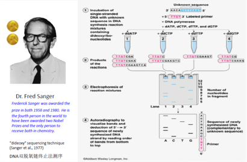
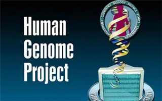
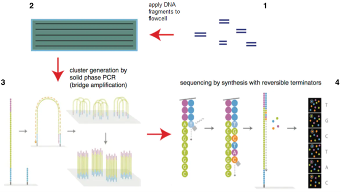
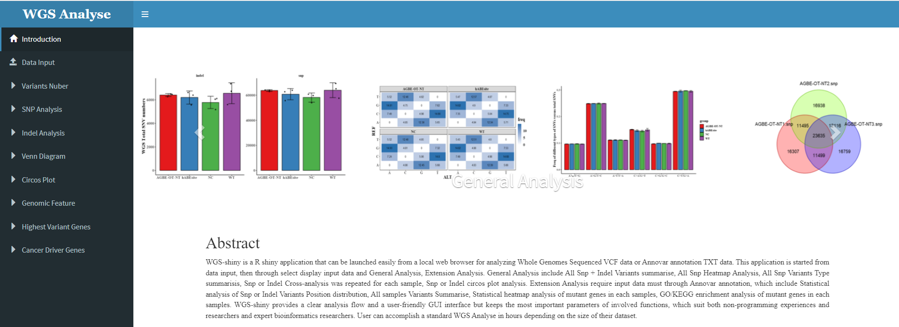

--- 
title: "WGS Shiny Description Document"
author: "Tao Chen; Shixue Gou"

date: "`r Sys.Date()`"
site: bookdown::bookdown_site
documentclass: book
bibliography: [book.bib, packages.bib]
# url: your book url like https://bookdown.org/yihui/bookdown
# cover-image: path to the social sharing image like images/cover.jpg
description: "WGS-shiny software Usage Instructions"
link-citations: yes
github-repo: rstudio/bookdown-demo
---

# Introduction

**WGS-Shiny** is a R shiny application that can be easily launched from a local web browser to analyze *whole-genome sequencing* data after variant calling for scientists without programming expertise.

## Background

### The development of sequencing technology

It took 15 years from the discovery of the double helix (1953) to the first DNA sequencing (1968). Modern DNA sequencing began in 1977 with the development of chemical sequencing by Maxam and Gilbert ([A.M. Maxam, W. Gilbert. 1977](references.html#ref1)) and dideoxy sequencing by Sanger, Nicklen and Coulson, as well as the first complete DNA sequence (phage rX174) ([Sanger F, Nicklen S, Coulson AR. 1977](references.html#ref2)), demonstrating that sequencing can provide profound insights into genetic organization. Incremental improvements allowed the sequencing of 200 kb (human cytomegalovirus) molecules, which produced a huge amount of data that required computational analysis and gave rise to the field of bioinformatics ([Hutchison,CA,3rd. 2007](references.html#ref3)).These labor-intensive processes contributed to the first human genome project, taking over a decade and costing $2.7 billion to complete ([NHGRI](references.html#ref4)).

#### Sanger sequencing
```{r echo = F, fig.cap = "Sanger_Sequencing", out.width="100%",fig.align='center'}

```

Nearly 25 years after the structure of DNA was discovered, the first method for sequencing DNA was published ([Sanger F, Nicklen S, Coulson AR. 1977](references.html#ref1)). This method involved the addition of chain-terminating and radioactively labeled (earlier approach) or fluorescently labeled (later approach) dideoxy nucleotides to perform sequencing of a DNA strand complementary to the interrogated template strand. The fragments were then size separated and analyzed by gel electrophoresis to determine the sequence. Known as Sanger-sequencing, the method continued to improve with the introduction of capillary electrophoresis and gained wide acceptance as a "first-generation sequencing" method to sequence small and large genomes from bacteria and phages, to humans. Given that only one sequencing reaction could be analyzed at a time, the method was of limited throughput. Sequencing of diploid DNA also complicated the discernment of haploid sequences critical to many diagnostic and investigative purposes, necessitating subcloning, plating, and DNA preparation of individual subclones before sequencing ([Hu T, Chitnis N, Monos D, Dinh A. 2021](references.html#ref5)). 

#### Human Genome Project

```{r echo = F, fig.cap = "Human_Genome_Project)", out.width="40%", fig.align='center'}

```

In 1984 scientists from United States Energy Departmentmet to discuss a project that would devise a technique to sequence the human genome. The aim was to launch studies to detect mutations in DNAs from Second World War survivors of the atomic bomb in Japan. Researchers from the National Institute of Health in the United States quickly joined the group and James Watson was designated to head
the Human Genome Research Institute, which became National Human Genome Research Institute (NHGRI) in 1989. Later, several countries joined the effort, particularly the United Kingdom, France, Japan, Canada, Germany and China and it became an international public consortium coordinated by the Human Genome Organization ([Venter,J.C (2007)](references.html#ref6))

#### Next Generation Sequencing Technologic

```{r echo = F, fig.cap = "Next_Generation_Sequencing", out.width="100%",fig.align='center'}

```

Between 2004 and 2006 "next-generation sequencing (NGS)" technologies were introduced, which transformed biomedical inquiry and resulted in a dramatic increase in sequencing dataoutput ([S. Levy, et. 2007](references.html#ref7)). The significant increase in data output was due to the nanotechnology principles and innovations that allowed massively parallel sequencing of single DNA molecules. The combined features of high throughput and single-molecule DNA sequencing are hallmarks of NGS, irrespective of the sequencing platform. The technology’s evolved procedures were better merged with data acquisition and analysis, freeing the community from more labor-intensive and low-efficiency historical Sanger sequencing approaches and facilitating an extraordinary increase in data output. Second-generation approaches, such as on the Illumina or Ion Torrent platforms, generally start with DNA fragmentation, DNA end-repair, adapter ligation, surface attachment, and in-situ amplification. These "short-read" sequencing technologies involve the massively parallel sequencing of short reads, whereby millions of individual sequencing reactions occur in parallel. However, by nature of being short-read technologies, sequencing data over long stretches of DNA must be reassembled, presenting challenges with structural variations or low-complexity regions ([Hu T, Chitnis N, Monos D, Dinh A. 2021](references.html#ref5)).


### Whole Genomic Sequencing

Explosive advances in next-generation sequencer (NGS) and computational analyses handling massive data have enabled us to comprehensively analyze cancer genome profiles at research and clinical levels, such as targeted sequencing for hundreds of genes, whole exome sequencing (WES), RNA sequencing (RNA-Seq) and whole genome sequencing (WGS)([Nakagawa H,et. 2015](references.html#ref8)). WGS approaches can cover all of these unexplored mutations and help us to better understand the "whole" landscape of cancer genomes and elucidate the functions of these unexplored human genomic regions. This approach combined with mathematical analysis and other omics analysis can clarify the underlying carcinogenesis and achieve molecular sub-classification of cancer, which facilitates discovery of genomic biomarkers and personalized cancer medicine ([Nakagawa H, Fujita M. 2018](references.html#ref9)).

### Research Significance

Data analysis of whole genome sequencing requires a bioinformatics background and programming skills that are difficult for most researchers. Therefore, there is an urgent need to develop interactive whole-genome data analysis tools that do not depend on programming languages. Based on the Web page framework provided by the R language shiny package and combined with the completed analysis process, this topic constructs a Web interactive analysis tool for the whole genome data, so as to enable more researchers to quickly and simply complete the whole genome data analysis.

## How to start

In this tutorial, we will go through the installation and usage of each module step by step using the example dataset we provided at *github:* <https://github.com/123xiaochen/WGS-shiny>.

### Requirement
1. R (>= 4.2.0)
2. Shiny (>= 1.6.0)

### How to install shiny packsge
1. Open *R*.
2. User can install the shiny package by the following command in R:

```{r, eval=FALSE}
install.package("shiny")
```

### How to install and run WGS-Shiny locally

1. Open *R*.
2. Run WGS-Shiny by the following commands in R:

```{r, eval=FALSE}
shiny::runApp('inst/shiny')
```

The first model of WGS-Shiny setting page will pop-up.

```{r echo = F, fig.cap = "File-Format", out.width="100%",fig.align='center'}

```
