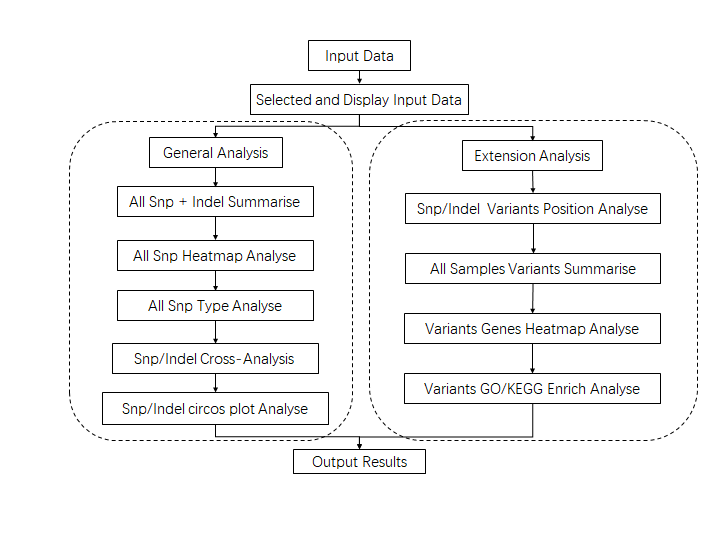
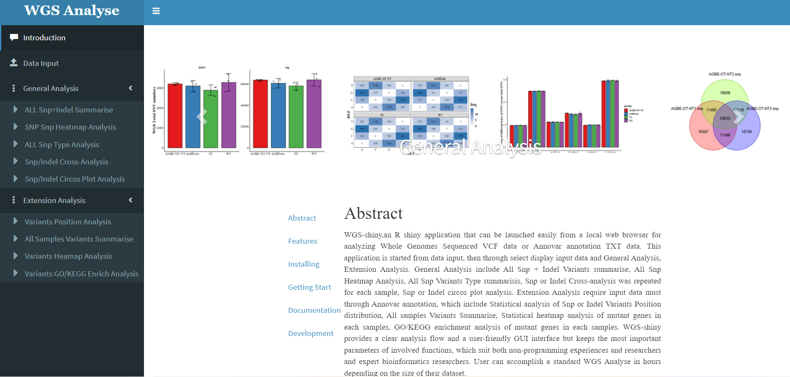

<h2 id="abstract" style="width:100%; text-align:left;font-family:&#39;Times New Roman&#39;, Times, serif;">Abstract</h2>

<p style="text-align:justify;font-family:&#39;Times New Roman&#39;, Times, serif;">WGS-shiny,an R shiny application that can be launched easily from a local web browser for analyzing Whole Genomes Sequenced VCF data or Annovar annotation TXT data. This application is started from data input, then through select display input data and General Analysis, Extension Analysis. General Analysis include All Snp + Indel Variants summarise, All Snp Heatmap Analysis, All Snp Variants Type summarisis, Snp or Indel Cross-analysis was repeated for each sample, Snp or Indel circos plot analysis. Extension Analysis require input data must through Annovar annotation, which include Statistical analysis of Snp or Indel Variants Position distribution, All samples Variants Summarise, Statistical heatmap analysis of mutant genes in each samples, GO/KEGG enrichment analysis of mutant genes in each samples. WGS-shiny provides a clear analysis flow and a user-friendly GUI interface but keeps the most important parameters of involved functions, which suit both non-programming experiences and researchers and expert bioinformatics researchers. User can accomplish a standard WGS Analyse in hours depending on the size of their dataset.</p>

<h2 id="features" style="width:100%; text-align:left;font-family:&#39;Times New Roman&#39;, Times, serif;">Workflow</h2>



<h2 id="install" style="width:100%; text-align:left;font-family:&#39;Times New Roman&#39;, Times, serif;">Installing</h2>

<h3 style="width:100%; text-align:left;font-family:&#39;Times New Roman&#39;, Times, serif;"> Installation </h3>


```
## install.packages("devtools") ## you may need install devtools first
devtools::install_github("123xiaochen/WGS-shiny")
```

<h2 id="getting-start" style="width:100%; text-align:left;font-family:&#39;Times New Roman&#39;, Times, serif;">Getting Start</h2>

<h3 style="width:100%; text-align:left;font-family:&#39;Times New Roman&#39;, Times, serif;"> Input data Requirements </h3>

- The input file requires all data to be stored in a compressed folder in the format of the file name.

<h4 style="width:100%; text-align:left;font-family:&#39;Times New Roman&#39;, Times, serif;"> Input Compress Files Requirements </h4>


- The compressed file name must be the same as the name of the compressed folder.
- The compressed file can be in *.tar. gz or *.zip format.

<h4 style="width:100%; text-align:left;font-family:&#39;Times New Roman&#39;, Times, serif;"> Input File Name Requirements </h4>


- The first box represents the sample name, which can be the group of experiments and the number of repetitions, connected by the character "-" or "_".
- The second box represents the data type, which can be snp or indel data. When snp and indel are not classified in the data, this box can be absent.
- The third box represents the data format, which can be vcf files, vcf. gz compressed files, and Annovar annotated TXT files.
- The contents of the three boxes are connected by ".".

<h3 style="width:100%; text-align:left;font-family:&#39;Times New Roman&#39;, Times, serif;"> Start your anlysis </h3>



<h2 id="documentation" style="width:100%; text-align:left;font-family:&#39;Times New Roman&#39;, Times, serif;">Documentation</h2>

The documentation is available at <a href="https://github.com/123xiaochen/WGS-shiny" target="_blank"> here </a>, the doc include a tutorial and example gallery.

<h2 id="development" style="width:100%; text-align:left;font-family:&#39;Times New Roman&#39;, Times, serif;"> Development </h2>

QRAP development takes place on Github: <a href="https://github.com/123xiaochen/WGS-shiny" target="_blank">https://github.com/123xiaochen/WGS-shiny</a>

Please submit any reproducible bugs you encounter to the <a href="https://github.com/123xiaochen/WGS-shiny/issues" target="_blank">issue tracker</a>

We will also put most commonly encountered issues in the ***FAQ*** page.

