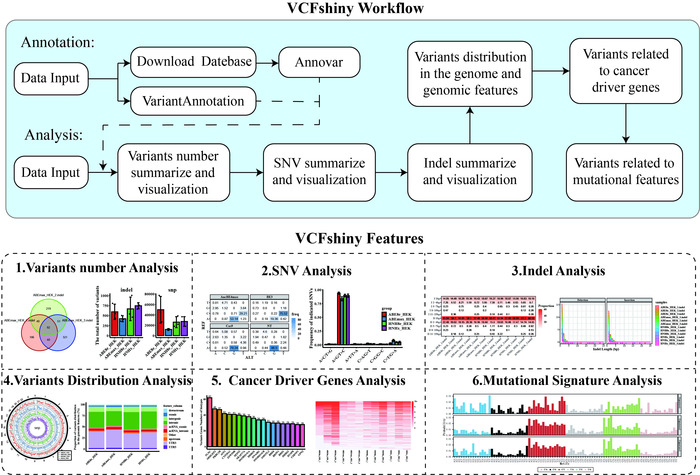

<h2 id="abstract" style="width:100%; text-align:center;font-family:&#39;Times New Roman&#39;, Times, serif;">Abstract</h2>

<p style="text-align:justify;font-family:&#39;Times New Roman&#39;, Times, serif;">Variants produced by next-generation sequencing are often recoded in variant call format (VCF) files. The VCF file stores the details of variations, including chromosome location, base sequence, base quality, read depth, genotype, etc. However, deciphering relevant biological insights from the VCF file can be a challenging task for studies without bioinformatics and programming backgrounds. Here, we described an R/Shiny application package named VCFshiny for interpreting and visualizing the variants stored in VCF files in an interactive and user-friendly way. VCFshiny provides annotations of two kinds of software, Annovar and VariantAnnotation, while summarizing variation information, These include total variation, variation overlap between samples, base changes for single nucleotide variants, length distributions of insertions and deletions, mutation-associated genes, variation distributions in the genome, and local variation in cancer driver genes. In each analysis session, we provided multiple visualization methods to help obtain an intuitive graph for publishing and sharing.</p>



<h2 id="getting-start" style="width:100%; text-align:left;font-family:&#39;Times New Roman&#39;, Times, serif;">Getting Start</h2>

<h3 style="width:100%; text-align:left;font-family:&#39;Times New Roman&#39;, Times, serif;"> Requirements </h3>
(1). R (>= 4.2.0). <br>
(2). Shiny (>= 1.6.0)

<h4 style="width:100%; text-align:left;font-family:&#39;Times New Roman&#39;, Times, serif;"> How to install shiny package: </h4>

```
## Open R ## you may need open R  first:
install.package("shiny")
```

<h4 style="width:100%; text-align:left;font-family:&#39;Times New Roman&#39;, Times, serif;"> How to install VCFshiny package: </h4>

```
## install.packages("devtools") ## you may need install devtools first
devtools::install_github("123xiaochen/VCFshiny")
```
<h4 style="width:100%; text-align:left;font-family:&#39;Times New Roman&#39;, Times, serif;"> Getting Start </h4>

```
## Loading and run the package.
library(VCFshiny)
VCFshiny::startVCFshiny()
```
<h2 style="width:100%; text-align:left;font-family:&#39;Times New Roman&#39;, Times, serif;"> Prepare Data </h2>
<p style="text-align:justify;font-family:&#39;Times New Roman&#39;, Times, serif;">In this section, we will introduce how to prepare two different input data sets: <p>

<h3 style="width:100%; text-align:left;font-family:&#39;Times New Roman&#39;, Times, serif;"> Source of VCF input data </h3>
<p style="text-align:justify;font-family:&#39;Times New Roman&#39;, Times, serif;">The Variant Call Format (VCF) is used to record gene sequence variations. It is also the first file format to be understood for genome population correlation analysis. The file is divided into two main parts: the Header comment section, which begins with #, and the body section.<p>

<h3 style="width:100%; text-align:left;font-family:&#39;Times New Roman&#39;, Times, serif;"> Source of TXT input data </h3>
<p style="text-align:justify;font-family:&#39;Times New Roman&#39;, Times, serif;">The txt file is one of several output formats followed by tab-delimited comments. Since some users cannot annotate steps, we provide two annotation methods, Annovar (Wang K, Li M, Hakonarson H. 2010) and VariantAnnotation (10.18129/B9.bioc.VariantAnnotation), which users can choose to annotate themselves or use this tool.<p>

<h3 style="width:100%; text-align:left;font-family:&#39;Times New Roman&#39;, Times, serif;"> Input data requirements </h3>

<p style="text-align:justify;font-family:&#39;Times New Roman&#39;, Times, serif;">The input file requires all data to be stored in a compressed folder in the format of the file name.<p>

<h3 style="width:100%; text-align:left;font-family:&#39;Times New Roman&#39;, Times, serif;"> Input compress files requirements </h3>


(1). The compressed file name must be the same as the name of the compressed folder.<br>
(2). The compressed file can be in *.tar. gz or *.zip format.

<h3 style="width:100%; text-align:left;font-family:&#39;Times New Roman&#39;, Times, serif;"> Input File Name Requirements </h3>


(1). The first box represents the sample name, which can be the group of experiments and the number of repetitions, connected by the character "-" or "_".<br>
(2). The second box represents the data type, which can be snp or indel data. When snp and indel are not classified in the data, this box can be absent **(I)**.<br>
(3). The third box represents the data format, which can be vcf files, vcf. gz compressed files, and Annovar annotated TXT files.<br>
(4). The contents of the three boxes are connected by ".".

<h2 id="documentation" style="width:100%; text-align:left;font-family:&#39;Times New Roman&#39;, Times, serif;">Documentation</h2>

The documentation is available at <a href="https://123xiaochen.github.io/VCFshiny/" target="_blank"> here </a>, the doc include a tutorial and example gallery.

<h2 id="development" style="width:100%; text-align:left;font-family:&#39;Times New Roman&#39;, Times, serif;"> Development </h2>

VCFshiny development takes place on Github: <a href="https://github.com/123xiaochen/VCFshiny" target="_blank">https://github.com/123xiaochen/VCFshiny</a>

Please submit any reproducible bugs you encounter to the <a href="https://github.com/123xiaochen/VCFshiny/issues" target="_blank">issue tracker</a>

We will also put most commonly encountered issues in the ***FAQ*** page.

